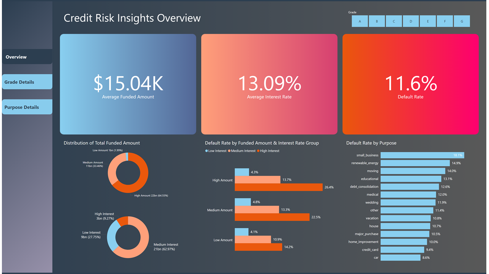
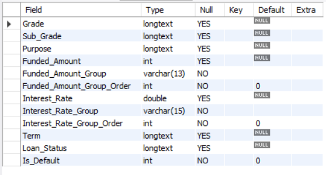
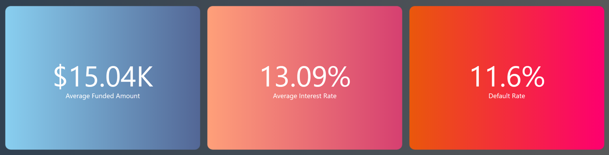

# Credit Risk Insights: Optimizing Loan Products by Grade and Purpose [Lending Club]

## Project Overview
Lending Club, a leader in the peer-to-peer lending industry, provides a wealth of data on borrower characteristics, loan performance, interest rates, and default rates. As fintech continues to grow, effective credit risk assessment has become crucial for minimizing defaults and enhancing loan approval processes. This project leverages Lending Club's data to generate actionable insights for optimizing loan products by analyzing key factors such as loan Grade, Purpose, and Default Rate.

Insights and recommendations are provided on the following key areas:
- **Borrower Risk Assessment**: Evaluation of borrower characteristics by loan Grade to identify risk levels and improve targeting for various loan products.  
- **Purpose-Based Performance**: Analysis of loan performance by Purpose to identify high-risk categories.
  
An interactive Power BI dashboard can be downloaded [here](https://app.powerbi.com/groups/me/reports/47bb9f14-9a87-492a-8b24-948a12c2f811/8f03a32be0be0e34306b?experience=power-bi "target=_blank").

## Data Structure & Preparation
The Lending Club Loan data is contained entirely in a single table with a total of 2,260,668 rows. Within the scope of this project’s analysis, we extract the columns as listed below.

Prior to beginning the analysis, various quality checks were conducted for control and familiarization with the datasets.  
The Python and Spark code used for ETL of data from CSV files into the MySQL Database can be found [here](etl_csv_to_mysql.ipynb).  
The SQL queries utilized to inspect and perform quality checks can be found [here](SQL_initial_checks.sql).  
The SQL queries used to clean the data can be found [here](SQL_clean_and_transform.sql).

## Key Insights
- The average loan amount stands at $15.04K, with an average interest rate of 13.09% and an average default rate of 11.6%.
- Low Amount loans (under $5,000) represent an exceptionally low proportion, accounting for only 1.99% of the total loan volume. However, they exhibit the lowest default rate compared to Medium Amount loans ($5,000 - $15,000) and High Amount loans (over $15,000), with a lower default rate across all three interest rate tiers (low: <10%, medium: 10-20%, and high: >20%).
  

- The default rate increases progressively across credit grades from A1 to G5. The average interest rate in these groups is higher than the average default rate for grades A through C, similar for grade D, and lower for grades E through G.
- The distribution of loan amounts by purpose shows significant variation, with a concentration in the top three: debt consolidation at approximately $20 billion, credit card at around $8 billion, and home improvement at about $2 billion. While credit card and home improvement rank in the lower range for default rates, debt consolidation ranks in the top 5 with a default rate of 12.6% (above the average of 11.6%).
- Most loan purposes have an average interest rate higher than the default rate; however, small business is an exception with a default rate of 18.1%, significantly higher than the average interest rate of 15.27%.

## Recommendations

## Assumptions and Caveats

